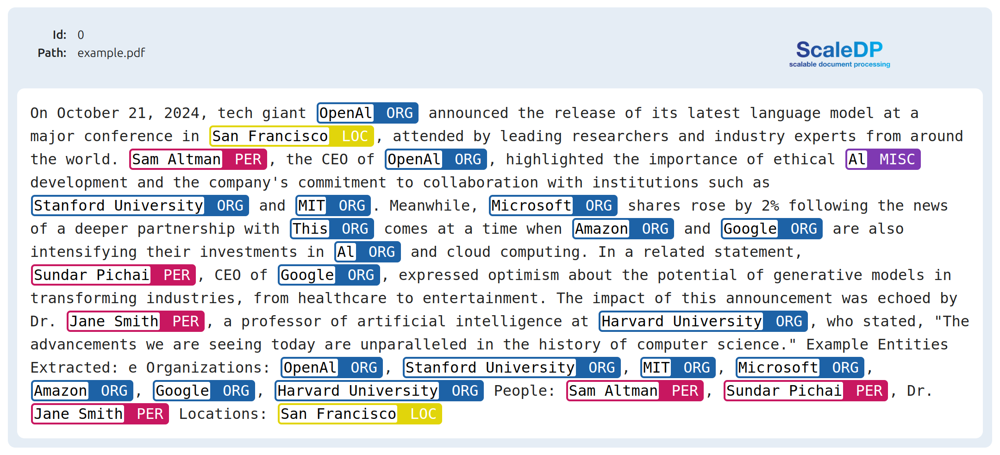
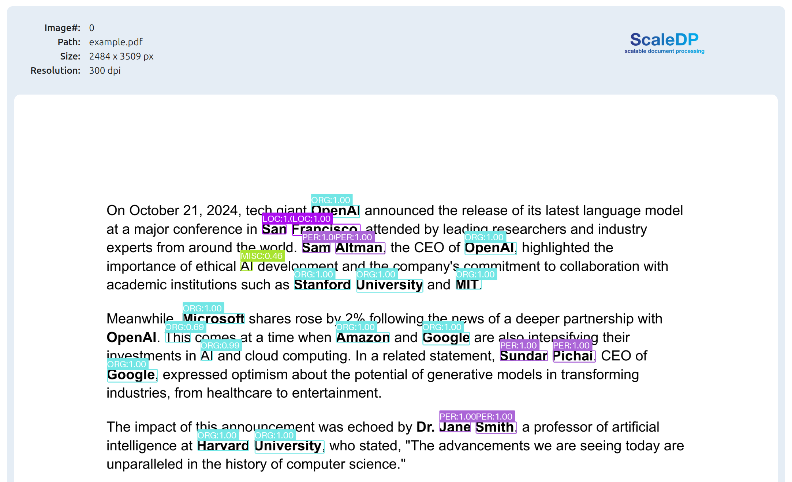

   
    
   

    <i>An Open-Source Library for Processing Documents in Apache Spark.</i>

    
    
    
    

# ScaleDP Tutorials

[ScaleDP](https://github.com/StabRise/scaledp/) is a library for processing documents using Apache Spark.
And this repository contains jupyter notebooks with tutorials and examples of usage ScaleDP library.

**Source Code**: <a href="https://github.com/StabRise/ScaleDP/" target="_blank">https://github.com/StabRise/ScaleDP</a>

ScaleDP includes the following features:

- Load PDF documents/Images
- Extract text from PDF documents/Images
- Extract text Images/PDF documents, OCR
- Zero-shot Data extraction from the Images/PDF documents using LLM
- Object detection over Images/PDF documents
- NER/LLM over Images/PDF documents 
- Visualize results on the images
- Compatible with Spark PDF Datasource

## Table of Contents

We advise to run all examples through Google Colab for the easiest setup. Google Colab allows you to run it for free. All examples were tested using Google Colab, so it should be the most stable platform. However, any other cloud provider or local run should work. 

### QuickStart and General Examples

| Chapter                              | Notebook                                                                                                                                                                           |
|--------------------------------------|------------------------------------------------------------------------------------------------------------------------------------------------------------------------------------|
| 1: QuickStart with ScaleDP           |    |
| 5: Efficient read PDF with Spark PDF |  |

### OCR Examples

| Chapter                           | Notebook                                                                                                                                                                      |
|-----------------------------------|-------------------------------------------------------------------------------------------------------------------------------------------------------------------------------|
| 1: Example of usage different OCR |  |

### Ner Examples
| Chapter             | Notebook                                                                                                                                                                         |
|---------------------|----------------------------------------------------------------------------------------------------------------------------------------------------------------------------------|
| 1: NER Examples     |     |
| 2: LLM NER Examples |  |

### Object Detection Examples

| Chapter                | Notebook                                                                                                                                                                                                  |
|------------------------|-----------------------------------------------------------------------------------------------------------------------------------------------------------------------------------------------------------|
| 1: YoloOnnxDetector    |    |
| 2: Face Detection      |       |
| 3: Signature Detection |  |

### De-identification Examples

| Chapter                            | Notebook |
|------------------------------------|----------|
| 1: De-identification Text          |          |
| 2: De-identification Images        |          |
| 3: De-identification PDF Documents |          |
| 4: De-identification Dicom         |          |

## Local Run

### Requirements

- Python 3.11
- Apache Spark 3.5 or higher
- Java 8, 11
- Tesseract 5.0 or higher
- Jupyter Lab | Google Colab

